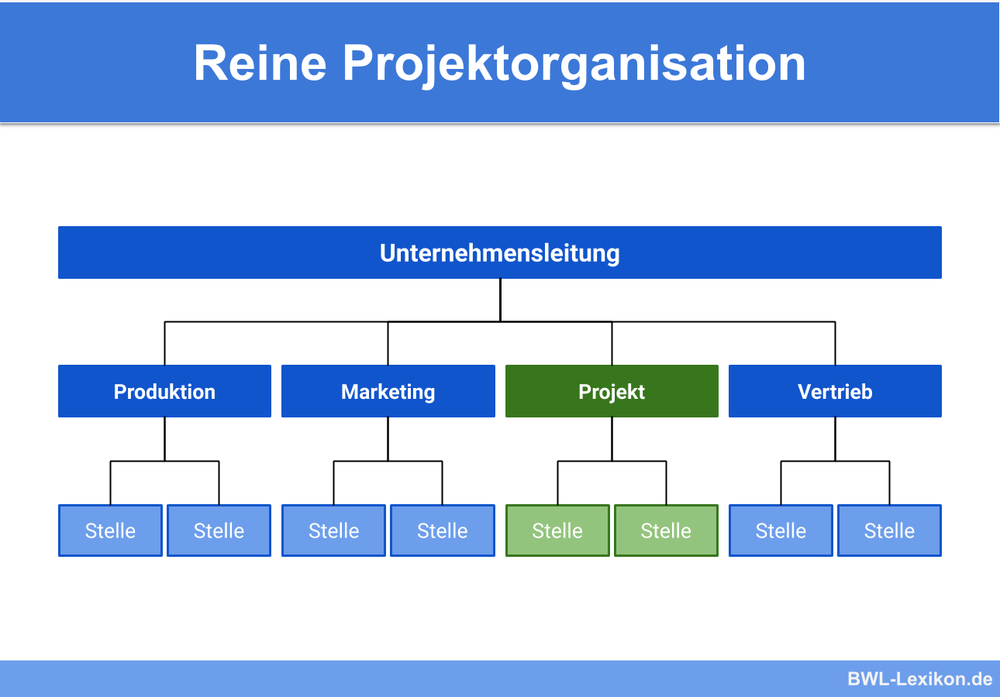
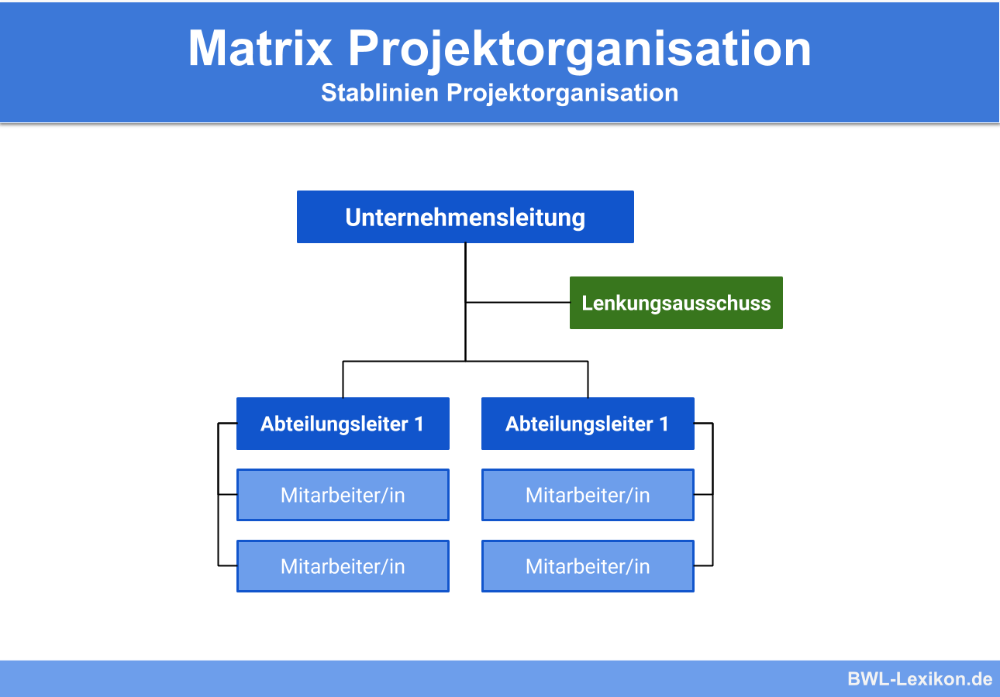
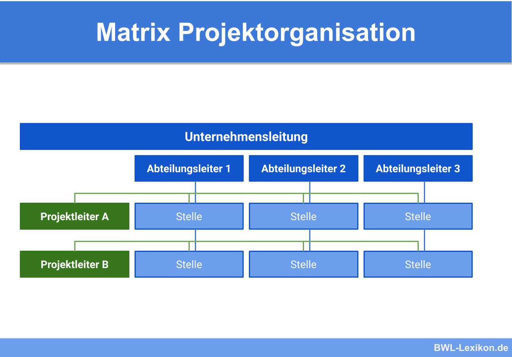

# Klassische Projektmanagement
**Definition:** 
	Projektmanagement umfasst die Führungsaufgaben, -organisation, -techniken und -mittel zur erfolgreichen Abwicklung eines Projektes.
## Ein Projekt
**Definition:**
	Ein Projekt ist ein Vorhaben, das im Wesentlichen durch Einmaligkeit der Bedingungen in ihrer Gesamtheit gekennzeichnet ist, z. B.: Zielvorgabe, zeitliche, finanzielle, personelle und andere Begrenzungen, Abgrenzung gegenüber anderen Vorhaben und projektspezifische Organisation 
### Merkmale
- **Einmalig**
  Das Vorhaben wird nur einmal Durchgeführt. **Keine Routinen Aufgabe!**
- **Zielvorgabe**
  Es gibt ein klares Ziel das verfolgt wird.
- **Zeitliche Begrenzung**
  Es gibt ein festgelegten Anfang und Endzeit für das Projekt
- **Begrenzte Ressourcen**
  Begrenzte Mittel um ans Ziel zu kommen (Mitarbeiter und Sachmittel)
- **Projektspezifische Organisation**
  Finden außerhalb der üblichen Unternehmensorganisation. (z.B. speziell Organisiertes Projektteam)
- **Komplexität**
  Es ist auf einen Blick schwer Überscheubar wegen der Menge von Zielen und Aufgaben.
### Ziel
#### SMART
**S**pecific
**M**easruable
**A**ttainable
**R**relevant
**T**ime-bound

## Projektmanagement
### Dreieck
![[Dreieck.png]]
- **Kosten**
  Welches Budget steht zur Verfügung? Was kostet mich das Projekt?
- **Zeit**
  Wie viel Zeit steht mir für die Umsetzung meines Projektes zu Verfügung?
- **Leistung / Qualität**
  Was soll eigentlich währendes Projektes entstehen? Und in welcher Qualität?

Fast alle Entscheidungen im Projekt wirken sich auf eine dieser drei Dimensionen aus.
Der/die Projektmanagerin hat die anspruchsvolle Aufgabe, diese Zielgrößen so
auszubalancieren, dass das Projekt zum Erfolg geführt wird. Und das ist oft schwierig,
da die drei Zielgrößen in der Regel miteinander konkurrieren

### Ablauf
| Projekt-Phase      | Aufgaben des PM                                                                                                                                                                                                                              |
| ------------------ | -------------------------------------------------------------------------------------------------------------------------------------------------------------------------------------------------------------------------------------------- |
| Definitionsphase   | - Ausgangsprobleme analysieren - Projektziele u. Anforderungen definieren - Lösungskonzept entwickeln - Machbarkeit analysieren - Projektvertrag abschließen - Projektorganisation installieren - Kick-off (Projektstart ) |
| Plannungsphase     | - Arbeitspackete Festlegen - Projektstrukturplan erstellen - Zeitplan erstellen - Personal- u. Resourcenplan - Kostenplan erstellen - Qualitätsplan erstellen                                                                 |
| Durchführungsphase | - Projektplan präzisieren/anpassen - Durchführung steuern und überwachen - Soll-Ist-Abweichung minimieren - Projekt dokumentieren - Änderung / Nachforderung koordinieren                                                        |
| Abschlussphase     | - Präsentation und Abnahme - Einweisung in das Projektergebnis - Evaluieren und Reflexion - Abschlussbericht erstellen                                                                                                              |
**Lastenheft:**
	Katalog der Anforderungen des Auftragsgebers and die Lieferung und Leistungen des Auftragsgeber  -> was wird gebraucht und wofür?
**Pflichtenheft:**
	Die Antwort auf das Lastenheft: Dokument, das der Auftragnehmer auf Basis des Lastenhefts des Auftraggebers erstellt. Der Auftragnehmer beschreibt, wie und womit die im Lastenheft definierten Anforderungen umgesetzt werden sollen.
## Projektorganisation

### Reine Projektorganisation

### Stabs Projektorganisation

### Matrix Projektorganisation

## Projektstrukturplan
