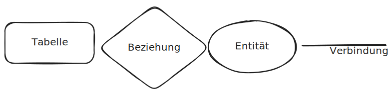

# Relationale Datenbanken
## Entity-Relationship-Diagrams (ERD)
### Zeichen der ER Diagramme

Eine Tabelle hat mehrere Entitäten, diese sind Datenwerte wie z.B Name oder Adresse.
Zwischen mehren Tabellen kann ein Beziehung (Eng.: Relationship) existieren die in zwei Formen verbunden werden kann:
- 1 zu n 
- 1 zu 1
*`1` zu `n`*  beschreibt Das ein Eintrag der Tabelle sich auf viele Einträge in anderen Tabelle beziehen kann.
Eine *`1` zu `1`* dahingegen beschreibt **ein** Eintrag in der ersten Tabelle auf **ein** Eintrag in der anderen Tabelle

## SQL
### Datentypen
| Name         | Bedeutung     | Beispiel                           |
| ------------ | ------------- | ---------------------------------- |
| `int`        | Ziffer        | 1,2,3,4,...                        |
| `varchar(*)` | Zeichenkett   | haus,baum,hunderte,...             |
| `bool`       | Boolean       | 0,1,true,false                     |
| `date`       | Datum         | 01.02.2024, 03.03.2002             |
| `timestamp`  | Ein Zeitpunkt | 01.02.2024 14:31, 03.04.2024 16:21 |

### Syntax
| Syntax                                       | Beschreibung                                                                                                                                           |
| -------------------------------------------- | ------------------------------------------------------------------------------------------------------------------------------------------------------ |
| SELECT                                       | Mit diesem Schlüsselwort beziehst du Gewisse Daten bei der Datenbank. Mann kann es auch mit einem * ersetzten um alle Felder Zu ziehen.                |
| FROM                                         | Definiert von welcher Datenbank du die Daten beziehen willst.                                                                                          |
| WHERE                                        | Bearbeitet eine Bedingung die die Daten die du Beziehst einhalten müssen                                                                               |
| JOIN \<*a*> ON \<*b*>.\<*c*> = \<*a*>.\<*d*> | Diese Aktion verbindet die genante Tabelle (*a*) auf der `FROM` Tabelle (*b*) mit der spalte (*c*) wo beim wert von Tabelle (*a*) mit der spalte (*d*) |
