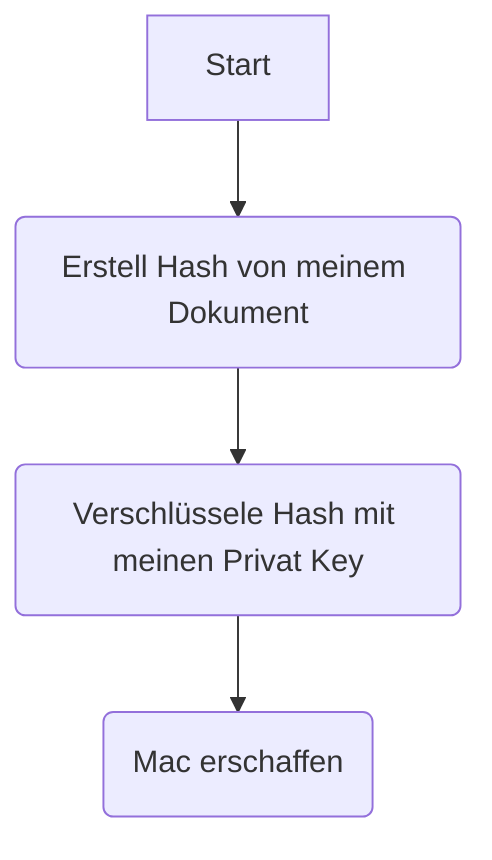
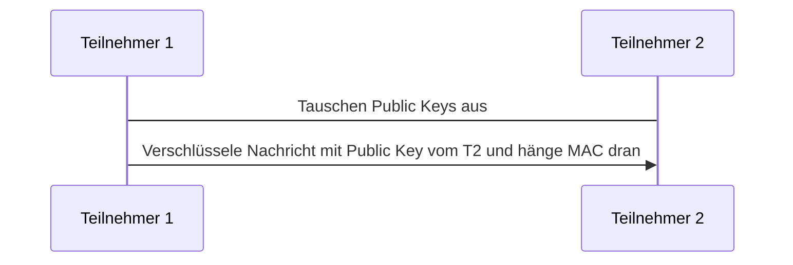

# Die 3 Grundsätze der IT-Sicherheit
- Vertraulichkeit
- Integrität
- Authentizität

# Asymmetrische Verschlüsselung
In der Asymmetrischen Verschlüsselung besteht aus zwei Kryptographischen Schlüssel. Einen Private Key und ein Public Key. Funktional sind die Schlüssel Identisch. Der Unterschied ist das wir sie anders behandeln in der Kommunikation.

Das Verfahren eine Nachricht verschlüsselt zu senden, wäre den Empfänger anfragen mir seinen Public Key zu senden.
Mit diesem Key verschlüssele ich meine Nachricht, welche er nur wieder mit seine Private Key entschlüsseln kann. 
Als Zusatz kann ich, um zu verifizieren das es von mir kommt (*Authentizität*), erstell ich eine Hash meiner Nachricht und verschlüssel diesen Hash mit meine Private Key. Dieses ermöglicht jeder der meine Public Key hat diesen Hash zu lesen, aber verifiziert das die Nachricht von mir kommt.

**Erstellen einer MAC**

**Ablauf einer Asymmetrischen Kommunikation mit MAC**
*Teilnehmer 1 sendet Nachricht and Teilnehmer 2*

**Anderer Name:** Public-Key-Kryptosystem

Diese Kryptographische Verschlüsselung Methode funktioniert, indem zwei Schlüssel zu Verfügung stehen. Eine Öffentlicher (Public Key) und Privater (Private Key). Der Public Key, wie der Name schon sagt, ist öffentlich zu Verfügung. Dieser wird benötigt um dir (Hälter des Private Keys) nachrichten zu senden.

Das Funktioniert indem jemand die Nachricht, mit dein Public Key, verschlüsselt. Diese Nachricht kann **nicht** wieder von diesem Entschlüsselt werden. Der einzige Schlüssel der diese Nachricht wieder entschlüsseln kann ist der Hälter vom Private Key.

## Veschlüsselungs Algorithmen
- RSA
- ECC

## Beispiele mit SSH

# Symmetrische Verschlüsselung
