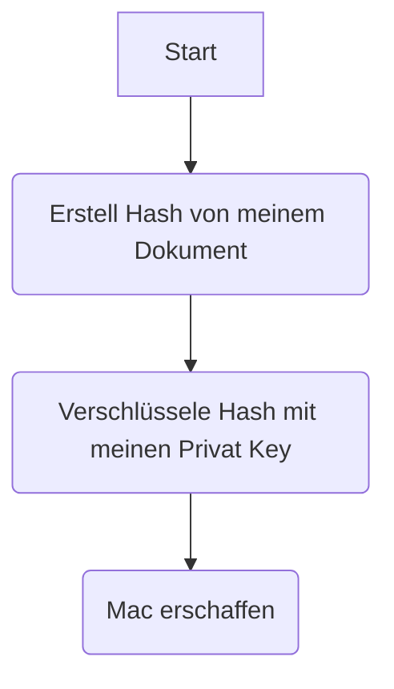
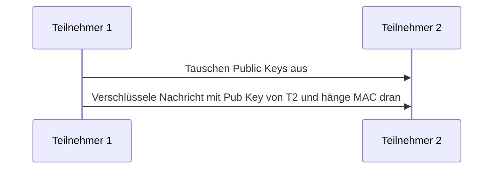
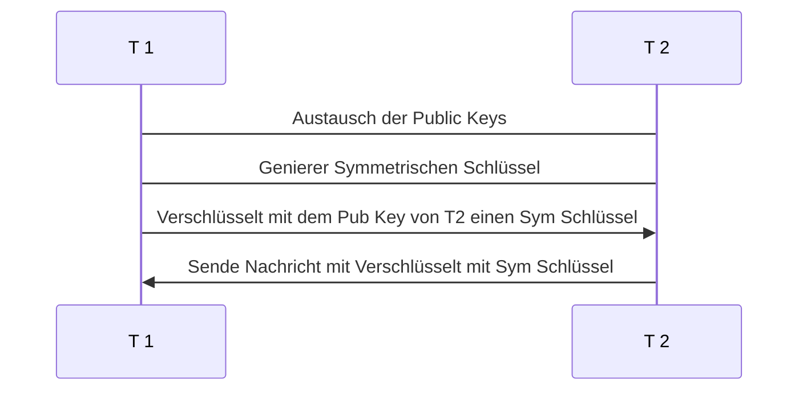
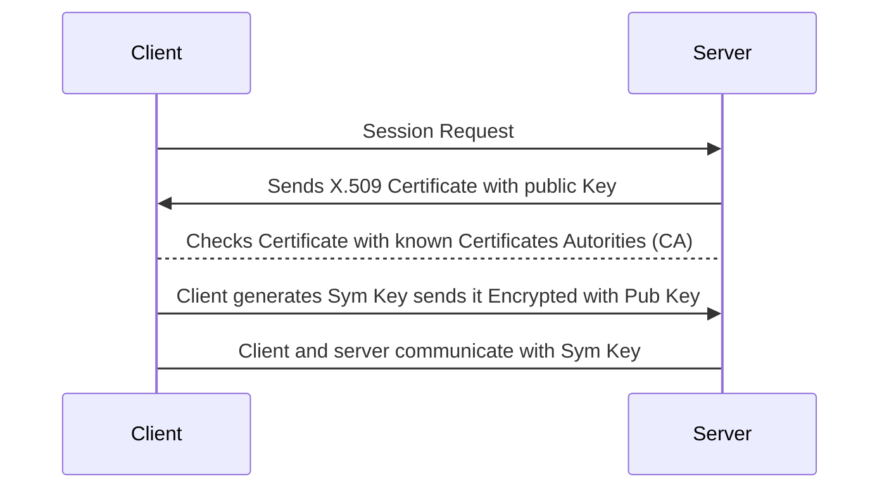

# Verschlüsselung
## Die 3 Grundsätze der IT-Sicherheit
- Vertraulichkeit
- Integrität
- Authentizität

## Asymmetrische Verschlüsselung
In der Asymmetrischen Verschlüsselung besteht aus zwei Kryptographischen Schlüssel. Einen Private Key und ein Public Key. Funktional sind die Schlüssel Identisch. Der Unterschied ist das wir sie anders behandeln in der Kommunikation.

Das Verfahren eine Nachricht verschlüsselt zu senden, wäre den Empfänger anfragen mir seinen Public Key zu senden.
Mit diesem Key verschlüssele ich meine Nachricht, welche er nur wieder mit seine Private Key entschlüsseln kann. 
Als Zusatz kann ich, um zu verifizieren das es von mir kommt (*Authentizität*), erstell ich eine Hash meiner Nachricht und verschlüssel diesen Hash mit meine Private Key. Dieses ermöglicht jeder der meine Public Key hat diesen Hash zu lesen, aber verifiziert das die Nachricht von mir kommt.

**Erstellen einer MAC**

**Ablauf einer Asymmetrischen Kommunikation mit MAC**
*Teilnehmer 1 sendet Nachricht and Teilnehmer 2*

### Probleme
- Sehr Resourcen Intensive
### Veschlüsselungs Algorithmen
- RSA
- ECC

## Symmetrische Verschlüsselung
Die Symmetrische Verschlüsselung ist hingegen weitaus einfacher. Es gibt ein Schlüssel der Ver- und Entschlüsselt. Der nachteil davon ist man muss iregenwie den Schlüssel dem Teilnehmer sicher übergeben

## Hybride Verschlüsselung
In der Hybriden verwenden wir beide sorten der Veschlüsselung. Diese ist am häufigsten verwendete form der Verschlüsselung, da sie leicht, sicher und Resourcen Effizent ist in der Kommunikation.

### Ablauf

## Digitales Zertifikat nach X.509

